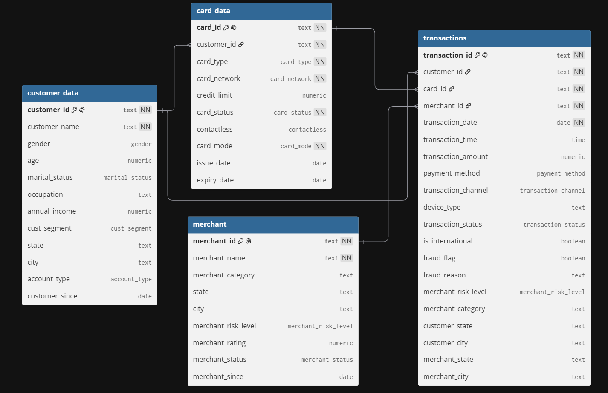

# Indian Financial Fraud Analysis (SQL)

A PostgreSQL project analyzing credit/debit card transactions to detect fraud patterns, quantify losses, and flag risky behavior — built as a portfolio piece to demonstrate SQL skills relevant to a data analyst role (window functions, CTEs, joins, aggregation).

**Tech stack:** PostgreSQL
**File:** [`indian_fraud_analysis.sql`](./indian_fraud_analysis.sql)

---

## Schema

Four tables model the fraud domain:

- **`customer_data`** — customer demographics (age, gender, income, segment, location)
- **`card_data`** — card details per customer (type, network, credit limit, status)
- **`merchant`** — merchant profile (category, risk level, rating, status)
- **`transactions`** — transaction-level records linking customer, card, and merchant, including `fraud_flag` and `fraud_reason`

---

## Queries

### 1. Card network-wise fraud counts
Which card networks (Visa, Mastercard, RuPay, Amex) see the most fraud — useful for network-level risk assessment.

```sql
select cd.card_network, count(cd.card_network) as network_fraud_counts
from card_data cd inner join transactions t
on cd.card_id = t.card_id
where t.fraud_flag is true
group by cd.card_network;
```

### 2. Card mode-wise fraud count
Compares fraud rates between physical and virtual cards, useful for informing card-issuance policy.

```sql
select cd.card_mode, count(cd.card_mode) as card_mode_fraud_count
from card_data cd inner join transactions t
on cd.card_id = t.card_id
where t.fraud_flag is true
group by cd.card_mode;
```

### 3. Contactless-wise fraud count
Checks whether contactless payments carry more fraud risk than chip/PIN transactions.

```sql
select cd.contactless, count(cd.contactless) as contactless_fraud_count
from card_data cd inner join transactions t
on cd.card_id = t.card_id
where t.fraud_flag is true
group by cd.contactless;
```

### 4. State-wise total fraud amount loss
Ranks states by total money lost to fraud and fraud as a percentage of total transaction value — highlights where financial exposure is highest.

```sql
select distinct merchant_state, 
sum(transaction_amount) filter(where fraud_flag is true) over(partition by merchant_state) as total_fraud_amount,
round(((sum(transaction_amount) filter(where fraud_flag is true) over(partition by merchant_state)*100.0)/sum(transaction_amount) over(partition by merchant_state)),2) as fraud_money_percentage
from transactions
order by fraud_money_percentage desc;
```

### 5. Rapid multi-merchant transactions (velocity check)
Flags customers with 3+ transactions at different merchants within a 10-minute window — a classic card-testing/fraud signature.

```sql
with cte as (select *, 
lead(merchant_id) over(partition by customer_id order by transaction_timestamp asc) as sec_merchant_id,
lead(transaction_timestamp) over(partition by customer_id order by transaction_timestamp asc) as sec_transaction_timestamp,
lead(merchant_id,2) over(partition by customer_id order by transaction_timestamp asc) as third_merchant_id,
lead(transaction_timestamp,2) over(partition by customer_id order by transaction_timestamp asc) as third_transaction_timestamp
from (select t.transaction_id, cd.customer_name, t.customer_id, t.merchant_id, t.transaction_date + t.transaction_time as transaction_timestamp
		from transactions t inner join customer_data cd on t.customer_id = cd.customer_id)
)

select customer_name
from cte
where third_transaction_timestamp - transaction_timestamp <= interval '10 minutes'
and merchant_id != sec_merchant_id
and sec_merchant_id != third_merchant_id
and merchant_id != third_merchant_id;
```

### 6. Impossible-travel detection
Finds physical-card transaction pairs in different cities less than 2 hours apart — a customer can't plausibly be in two places that fast, so this flags likely card cloning.

```sql
with cte as (
select *, 
lead(transaction_id) over(partition by customer_id order by transaction_timestamp asc) as next_transaction_id,
lead(card_mode) over(partition by customer_id order by transaction_timestamp asc) as next_card_mode,
lead(customer_id) over(partition by customer_id order by transaction_timestamp asc) as next_customer_id,
lead(merchant_city) over(partition by customer_id order by transaction_timestamp asc) as next_merchant_city,
lead(transaction_status) over(partition by customer_id order by transaction_timestamp asc) as next_transaction_status,
lead(transaction_timestamp) over(partition by customer_id order by transaction_timestamp asc) as next_transaction_timestamp
from (select t.transaction_id, t.customer_id, t.transaction_date + t.transaction_time as transaction_timestamp,
		t.merchant_city, t.transaction_status, cd.card_mode
		from transactions t join card_data cd on t.card_id = cd.card_id)
)

select * from cte
where next_transaction_timestamp - transaction_timestamp <= interval '2 hours'
and card_mode = 'Physical' and next_card_mode = 'Physical';
```

### 7. Repeat frauds within 30 days
Identifies customers hit by fraud more than once within a month — useful for prioritizing accounts that need extra monitoring or a card reissue.

```sql
with cte as (
select *, 
lead(customer_name) over(partition by customer_id order by transaction_timestamp asc) as next_customer_name,
lead(customer_id) over(partition by customer_id order by transaction_timestamp asc) as next_customer_id,
lead(transaction_timestamp) over(partition by customer_id order by transaction_timestamp asc) as next_transaction_timestamp
from (select t.customer_id, cd.customer_name, t.transaction_date + t.transaction_time as transaction_timestamp
		from transactions t join customer_data cd on t.customer_id = cd.customer_id
		where fraud_flag is true)
)

select customer_id, customer_name
from cte
where next_transaction_timestamp - transaction_timestamp <= interval '30 days';
```

### 8. Segment-wise fraud rate & credit utilization
Compares fraud rate, average transaction size, and credit-limit utilization across customer segments (Basic/Gold/Platinum/Standard) — helps tie fraud exposure to customer tiering.

```sql
select distinct cd.cust_segment,
round((count(*) filter(where t.fraud_flag is true) over(partition by cd.cust_segment)*100.0) / count(*) over(partition by cd.cust_segment) , 2) as fraud_rate,
round(avg(transaction_amount) over(partition by cd.cust_segment) , 2) as avg_transaction_amount,
round((sum(t.transaction_amount) over(partition by cd.cust_segment)*100.0) / sum(card.credit_limit) over(partition by cd.cust_segment) , 2) as avg_credit_limit_utilisation
from transactions t 
join customer_data cd on t.customer_id = cd.customer_id
join card_data card on t.card_id = card.card_id;
```

### 9. Fraud rate by merchant category
Ranks merchant categories by fraud rate, helping identify which business types need stricter risk controls.

```sql
with cte as (
select distinct m.merchant_category, count(*) filter(where t.fraud_flag is true) over(partition by m.merchant_category) as fraud_count,
count(*) over(partition by m.merchant_category) as total_count
from transactions t join merchant m
on t.merchant_id = m.merchant_id
)

select merchant_category, round((fraud_count*100.0)/total_count, 2) as fraud_rate from cte order by fraud_rate desc;
```

### 10. Potential shell companies (abnormal international transaction share)
Compares each merchant's share of international transactions against its category average — merchants far above their category norm are potential shell companies or laundering fronts.

```sql
with cte as(
select distinct m.merchant_category,count(*) filter(where t.is_international is true) over(partition by m.merchant_category) as int_count,
count(*) over(partition by m.merchant_category) as total_count
from transactions t join merchant m
on t.merchant_id = m.merchant_id
), 
cte2 as (
select merchant_category, round((int_count*100.0)/total_count, 3) as int_avg from cte
)

select distinct m.merchant_id, m.merchant_name, cte2.merchant_category, 
round((count(*) filter(where t.is_international is true) over(partition by m.merchant_id))*100.0/cte2.int_avg, 3) as int_comparison
from merchant m
join cte2 on m.merchant_category = cte2.merchant_category
join transactions t on m. merchant_id = t.merchant_id
order by int_comparison desc;
```

### 11. Benford's Law check
Tests whether the leading digits of transaction amounts follow Benford's Law distribution — a real-world dataset should skew toward smaller leading digits (1, 2, 3); large deviations can indicate fabricated or manipulated amounts.

```sql
with cte as (
select row_number() over() as first_number from transactions limit 9
)
select c.first_number,
round(sum((case when left(t.transaction_amount::text, 1) = c.first_number::text then 1 else 0 end))*100.0/count(t.transaction_amount), 2) as count
from transactions t, cte c
group by c.first_number
order by c.first_number asc;
```

---

## Key Skills Demonstrated
Window functions (`LEAD`, `PARTITION BY`,`ORDER BY`), CTEs, Subqueries, `FILTER` clauses, timestamp arithmetic for fraud-pattern detection, and multi-table joins across a normalized schema.
